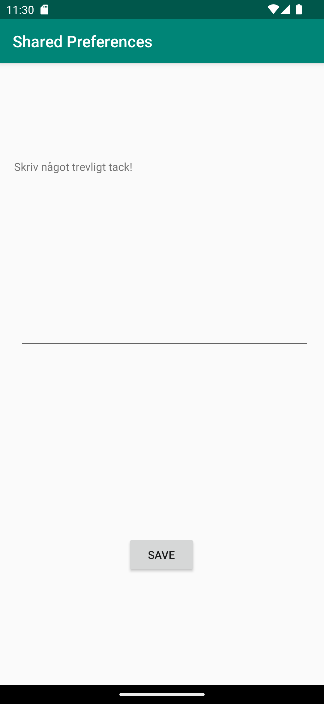
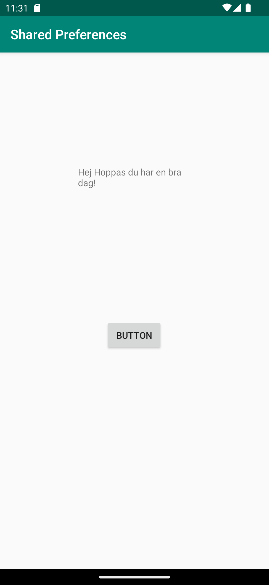

# Rapport

Först skapas en ny aktivitet som jag kallar SecondActivity, i activity_second.xml lägger jag in TextView, Button och EditText.
I MainActivity finns det en onResume som gör så att om appen startas om så sparas den senaste inputen som sparats i EditText i SecondActivity.
Inputen från SecondActivity hämtas till MainActivity via getString, se kodexempel 1.

SecondActivity och MainActivity har en delad preference vid namn "MyPreferenceName" som sparar texten.

i SecondActivity finns savePref. Detta gör så att den text som matats in i EditText sparas och detta hämtas sedan i MainActivity.

## Följande grundsyn gäller dugga-svar:


```
kodexempel 1.
@Override
        public void onResume() {
            super.onResume();

            myPreferenceRef = getSharedPreferences("MyPreferenceName", MODE_PRIVATE);
            myPreferenceEditor = myPreferenceRef.edit();

            prefTextRef =  findViewById(R.id.textView);
            
            prefTextRef.setText(myPreferenceRef.getString("MyAppPreferenceString","No preference found."));
    }
    -----------------------------------------------------------------------------------------------------------
    @Override
    protected void onCreate(Bundle savedInstanceState) {
        super.onCreate(savedInstanceState);
        setContentView(R.layout.activity_second);
        myPreferenceRef = getSharedPreferences("MyPreferenceName", MODE_PRIVATE);
        myPreferenceEditor = myPreferenceRef.edit();
    }
    ------------------------------------------------------------------------------------------------------------
    public void savePref(View v){
        // Get the text
        newPrefText=new EditText(this);
        newPrefText=(EditText)findViewById(R.id.settingseditview);

        // Store the new preference
        myPreferenceEditor.putString("MyAppPreferenceString", newPrefText.getText().toString());
        myPreferenceEditor.apply();

        // Display the new preference
        TextView prefTextRef=new TextView(this);
        prefTextRef=(TextView)findViewById(R.id.prefText);
        prefTextRef.setText(myPreferenceRef.getString("MyAppPreferenceString", "No preference found."));

        // Clear the EditText
        newPrefText.setText("");
    }
```

Bilder läggs i samma mapp som markdown-filen.





